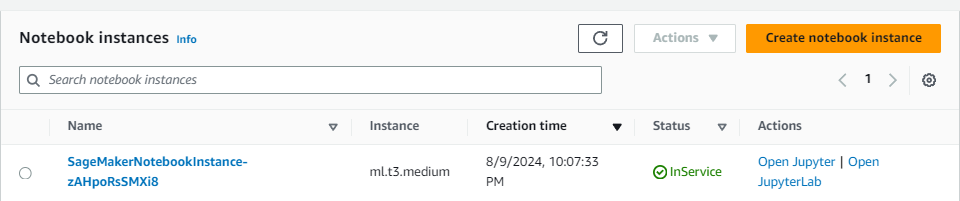
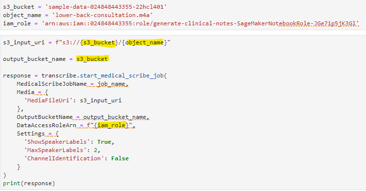
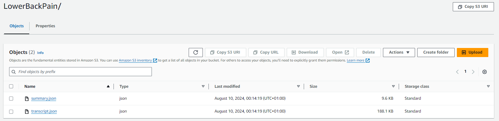

# AWS HealthScribe APIs
<br>
AWS HealthScribe is used to build clinical applications that use speech recognition and generative AI to automatically generate preliminary clinical documentation. The abobe image demostrates the lifecycle from capturing audio and producing transcriptions, and it can be applied to any healthcare scenario. 

Capturing the audio itself should be done by the healthcare professionals, then this audio should be stored in an S3 bucket for access. Then using the AWS HealthScribe API, the audio is summarised and trasncribed, and the output is then stored in an S3 bucket. This output can be made then available through an application or a software product connected to AWS with access to the output S3 bucket. 

In this tutorial, the HealthScribe API is accessed from within the Jupyter Notebooks, using the `boto3` AWS SDK, which provides a Python API for AWS infrastructure services and allows us to write software that makes use of services such as the HealthScribe API and Amazon S3. We will be using the transcribe service which is accessed in Python using `transcribe = boto3.client('transcribe', 'us-east-1')`.

The notebooks associated with the HealthScribe API are: 
- `1_HealthScribe_API.ipynb`
- `2_HealthScribe_ComprehendMedical.ipynb`
- `3_HealthScribe_Bedrock.ipynb`

## Opening Jupyter Notebooks
If this is your first time working on Jupyter Notebooks within Amazon SageMaker, this <a href="https://docs.aws.amazon.com/sagemaker/latest/dg/nbi.html">article</a> by AWS is a good starting point.

1. Navigate to **Amazon SageMaker** in the **us-east-1 (N. Virginia)** region
2. If not already, **setup Amazon SageMaker for single user**
3. Find **Notebooks** on the left menu (under Applications and IDEs)
4. Find your notebook instance starting with `SageMakerNotebookInstance` &rarr; Open in Jupyter <br>
5. Double click on the folder `sup-hcls-generate-clinical-notes-with-ai`

## Process Audio files

1. Open `1_HealthScribe_API.ipynb`
2. If you are prompted to choose a kernel, choose **conda_python3**
3. Before you run the notebook, make sure to replace the **\[S3_BUCKET_NAME\]**, **\[OBJECT_NAME\]** and **\[IAM_ROLE\]** placeholders in the 5th cell with your own information from the previous steps. You can even create your own variables to store these, however note that you will need to slighly change the code, as shown below:<br>
4. Run all cells

More information on the `AWS HealthScribe` API through `boto3` can he found <a href="https://boto3.amazonaws.com/v1/documentation/api/latest/reference/services/transcribe.html">here</a>.<br>
   
The `1_HealthScribe_API.ipynb` file provided in this directory includes more comments and markdown to make comprehension of the code easier to understand. After running the code, you should have two files, `transcript.json` and `summary.json` available within your S3 bucket `sample-data-xxxx`; these will be placed automatically within a foler with the name `LowerBackPain` which is the job name for the transcription. These files won't be accesible through their Object URL, since the bucket is not public (you can change this through the bucket `Permissions` tab), however you can download the files and inspect them.<br>

   
## Comprehend Medical Language

Taking our output one step further, we would like now to recognise medical language and detect medical conditions. The `Amazon Comprehend Medical` service will be used to return  ICD-10-CM codes and descriptions for the condition using the `infer_icd10_cm` class. A list of conditions will be returned in descending order of confidence.<br>

We can also use the `infer_rx_norm` to list potentially matching RxCUIs for each medication that it detects in descending order by confidence score. The output mau be empty, as in this example, if no matches with the ontology from the audio are found.

1. Open `2_HealthScribe_Comprehend.ipynb`
2. Run all cells

## Bedrock Integration for Anthropic models

An alternative to the `Amazon Comprehend Medical` would be to use LLM models to infer ICD-10 and procedure codes based on the plan generated by `AWS HealthScribe`, especially for codes that are not currently provided by the service. <br>

In this case, `Claude v3 Sonnet` from Anthropic will be used since it's lightweight, however any other model can be used by activating it through `Amazon Bedrock` and refering to it within the code by its model id. <br>

By using an LLM model, we need to give a prompt such as `what is the CPT code for an x-ray of their lower back?` or by using the plan generated by `AWS HealthScribe` we can have a more detailed prompt such as:<br>

```
prompt = f"""

For each one of the bullet points defined in <plan></plan> XML tags between triple backslashes, 
list the most common CPT codes applicable. If there are no codes for a recommendation, do not include them in your response.

<plan>{plan}</plan>

```

1. Open `3_HealthScribe_Bedrock.ipynb`
2. Run all cells