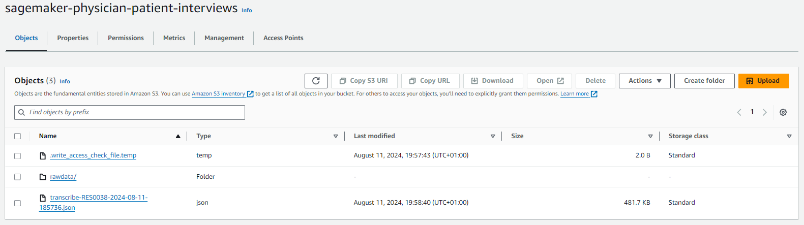

# Amazon Transcribe with Bedrock integration


`Amazon Transcribe` is used for transcribing audio files, and similarly to `AWS HealthScribe`, generates full transcriptions, however it provides no summary of the transcription itself; for this case we will use Amazon Bedrock to get access to LLM models for generating the summary and further information as necessary. The audio files need to be stored within an `Amazon S3` bucket and processed through a Sagemaker Notebook instance with Amazon Bedrock. The package `tscribe` will be used to format the output from a `JSON` file as it is generated by the API to a `CSV` file; this is done to facilitate the construction of a more comprehensible prompt for the LLM models.

## Audio files

Sample recordings from the paper **Fareez, F., Parikh, T., Wavell, C. et al. A dataset of simulated patient-physician medical interviews with a focus on respiratory cases. Sci Data 9, 313 (2022). https://doi.org/10.1038/s41597-022-01423-1** will be used, and downloaded straight from within the notebook instance using the command:

`!curl -L --output data.zip https://springernature.figshare.com/ndownloader/files/30598530`

This file needs to be unzipped, and contains a collection of audio files along with their transcripts. For the purpose of this tutorial, the transcripts will be ignored.

## Adding a custom bucket name with SageMaker session

S3 buckets can be created within a SageMaker notebook instance, however it is crucial to note that these buckets have `S3FullAccess` permission. Using `sagemaker.Session(default_bucket=None)` within the notebook we can create a bucket that has all the necessary permissions. If no name is given to the `default_bucket` attribute, then a bucket with the name `sagemaker-<region>-<aws-user>` will be created (if not already available).

For adding a custom bucket name to the `default_bucket` attribute, it is essential for the name to be in the format `sagemaker-custom-name` for it to inherit all necessary permissions. No error will be raised if the `default_bucket` attribute is not in this format, however any other interaction (adding, removing files) with the bucket will either raise an error `Bucket does not exist` or `Access denied`.

A prefix has been defined as `rawdata` to the files path. In the UI this looks like a folder, however for S3 this defines a path, in this case `media_uri = f"s3://{bucket}/{prefix}/{'Audio Recordings'}/{object_name}"` to access a specific audio file.



## LLM output in chunks

Claude 3 Sonnet and Claude 3 Haiku are used to generate the summary of the transcripts based on the following prompt: <br>
```
prompt = '''You will be reading a transcript of a recorded conversation between a physician and a patient. You will find the conversation within the transcript XML tags. Your goal is to summarise 
it, capture the most significative insights and propose the appropriate action plan under a section named ‘clinical plan’ that includes the following sections: Chief complaint; History of present 
illness; Review of systems; Past medical history; Assessment; Plan; Physical examination. Per each claim you make, you need to indicate which lines of the transcript supports it (please indicate 
only the line numbers within the tag <line></line>).
<transcript>
%s
</transcript>
''' % "\n".join(interaction)
```
The Amazon Bedrock service generates the entire summary for the given prompt in a single output; it waits for the whole response to be generated before returning it, however this can be slow if the output contains large amounts of tokens. Amazon Bedrock can also stream the output while it's being generated in chunks by the model by using `bedrock_runtime.invoke_model_with_response_stream` instead of `bedrock_runtime.invoke_model`. For the response stream itself, a custom function needs to be constructed that accepts the response stream as a parameter and displays it in chunks:

```python
def teletype_model_response(stream):
    output = []
    i = 1
    if stream:
        for event in stream:
            chunk = event.get('chunk')
            if chunk:
                chunk_obj = json.loads(chunk.get('bytes').decode())
                if chunk_obj['type'] == 'content_block_delta':
                    text = chunk_obj['delta']['text']
                    clear_output(wait=True)
                    output.append(text)
                    display_markdown(Markdown(''.join(output)))
                    i += 1
```

