# Generating Clinical Notes with AI

This tutorial explores different approaches to transcribe and summarise consultations between patients and healthcare practicioners and how to format the output as clinical notes. These approaches are especially useful during hospital visits and clinical trials as all conversations are autonatically recorded and transcribed, reducing manual labour, and can be revisited and reviewed by healthcare practicioners at any moment. These transcriptions can also be useful to law firms that handle medical negligence cases as it provides more background information and details than written/typed medical documents.

Two different ways of generating clinical documentation will be explored:
- Using AWS HealthScribe to automatically identify speaker roles, classify dialogue and extract medical terms to generate preliminary clinical transcripts and notes. The benefit of this API lies in its ability of fast-implementation; no need of using and optimising separate AI services.
- Using a combination of Amazon Transcribe and Claude 3 generalised LLM family hosted on Amazon Bedrock. This is a great approach if the AWS HealhScribe is not available in the region, and allows for customisation. 

This tutorial is an adaptation of the <a href="https://catalog.us-east-1.prod.workshops.aws/workshops/989c3aad-3f3e-405f-8519-13552cdd98eb/en-US">AWS workshop on "Generating Clinical Notes with AI"</a>, however it provides more detailed information and images that act as a visual guide, ideal for beginners that want to create simple AI applications on AWS.

## AWS Regions
This tutorial has to be run in US East 1 (N. Virginia) given that's the only region currently supporting AWS HealthScribe.

For AWS hoted events, Amazon Bedrock can only be used in US West 2 (Oregon) so Bedrock API calls will be sent to that region by default in our example notebooks.

When running the workshop in your own AWS account, follow the cleanup steps at the end of the workshop to avoid incurring additional costs after you complete all the labs.

## Files
- AWS CloudFormation file `main.yaml`
- Audio file (to be used for transcribing) - this audio file includes a lower back clinical consultation.

## Setting up AWS Environment
### Upload CloudFormation template
1. Navigate in **us-east-1 (N. Virginia)**
2. Search for **CloudFormation**
3. **Create Stack**   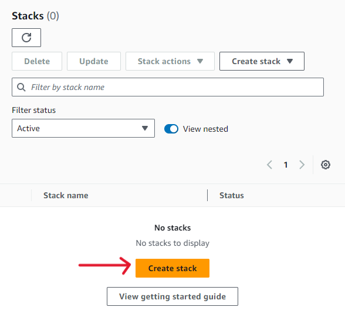
4. Choose **existing template** &rarr; **Upload Template File** &rarr; **Choose file** (`main.yaml`) &rarr; Next 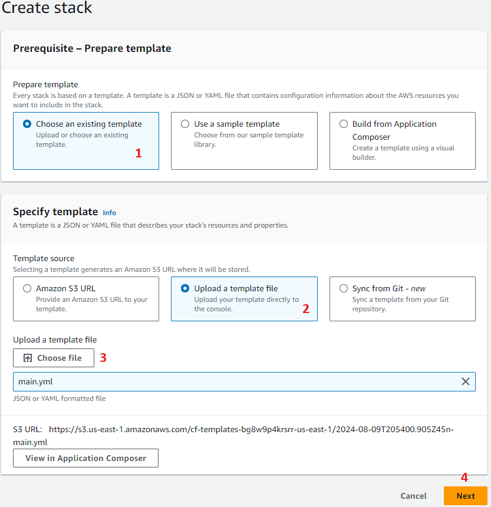
5. Give a **name** to your stack and **leave the default values for parameters** &rarr; **Next**   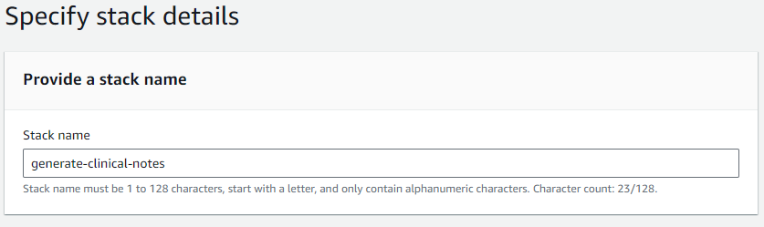
6. **Review and create** &rarr; **Accept acknowledgements** &rarr; **Submit**   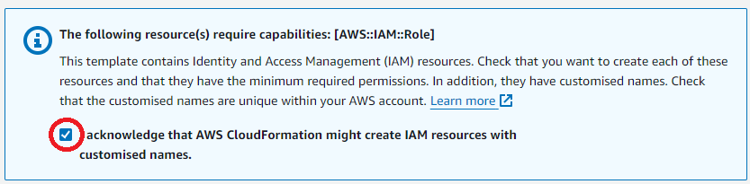
   
The above template will take a few minutes to complete as it creates S3 buckets for the sample data (in this case audio files) and output (transcription), a SageMaker notebook, source code for transcription, and IAM roles for the Jupyter Notebook execution. When creattion is completed, the stack will change status from `CREATE_IN_PROGRESS` to `CREATE_COMPLETE`, as shown in the images below. You can refresh the stack page to track its progress.  
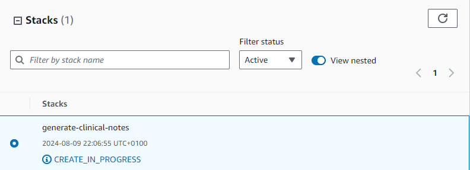 
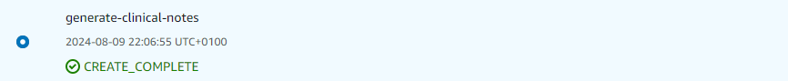

If you leave the page and not seeing your stack when navigating again to the CloudFormation page, make sure your region is set to us-east-1 (N. Virginia).

### Upload Audio file
1. Navigate to **Amazon S3**
2. Select the bucket starting with `sample-data-xxxx`   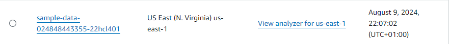
3. Select **Upload**   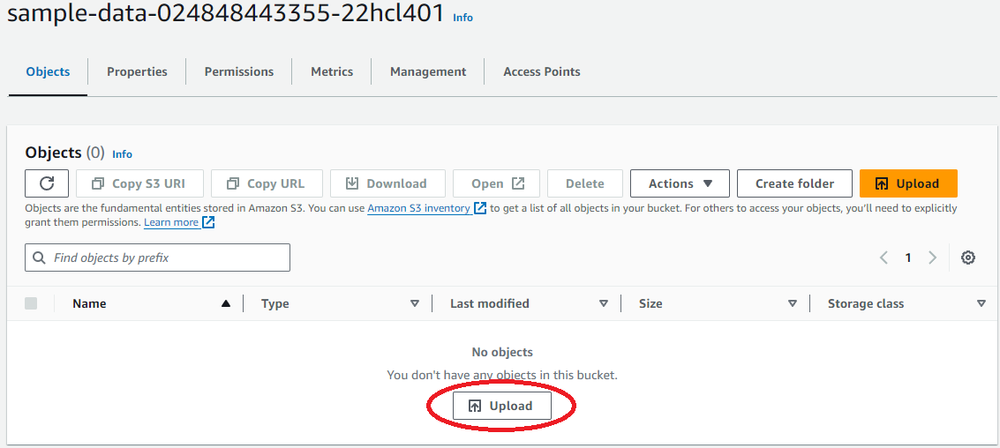
4. Click on **Add Files** &rarr; **Add audio file** &rarr; Click on **Upload**   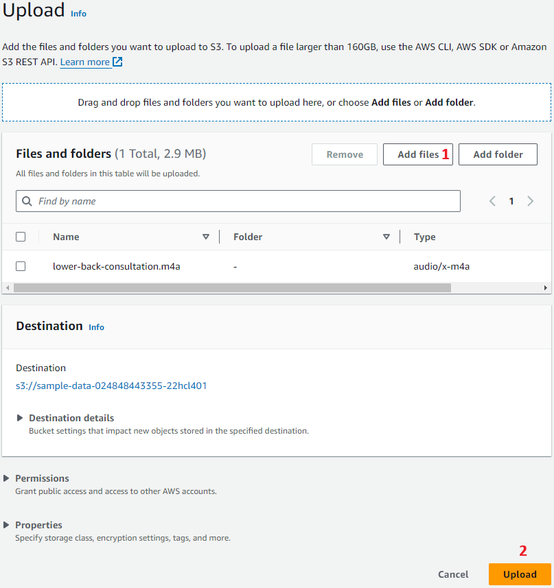

### Update IAM Role
As mentioned above, the stack template will create IAM roles for the SageMaker Jupyter notebook, however we need to add permissions to one of these roles.

1. Navigate to **IAM** (this is a global service, no need to switch regions)
2. Select **Roles** &rarr; Search for the cloud formation stack template by name (in my case the name is `generate-clinical-notes`) &rarr; Choose the `xxxx-SageMakerNotebookRule-xxxx` role   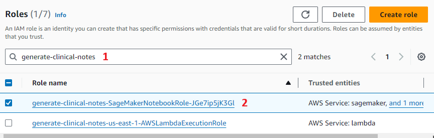
3. Click on **Add Permissions** and create **Inline Policy**  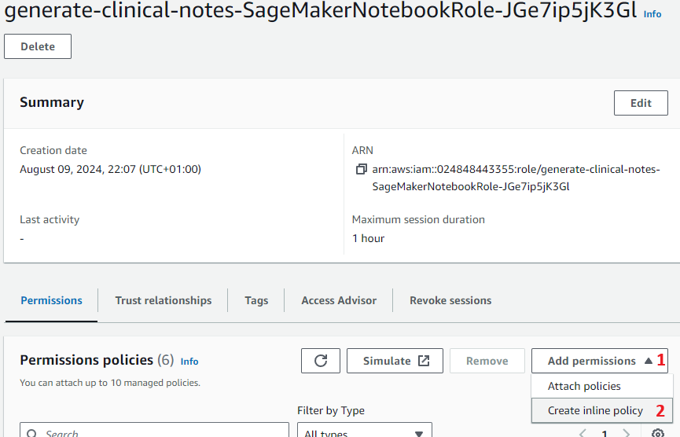
4. Search for **IAM** &rarr; Search and Select **PassRole** &rarr; Select **All** under **Resources**   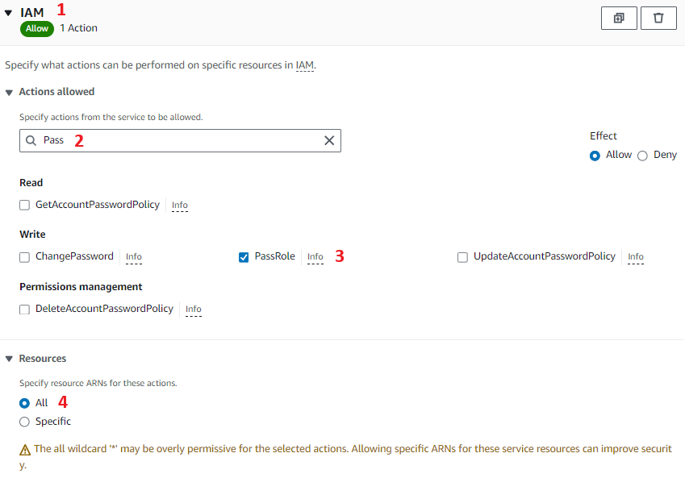
5. Add a **policy name** &rarr; **Create policy**   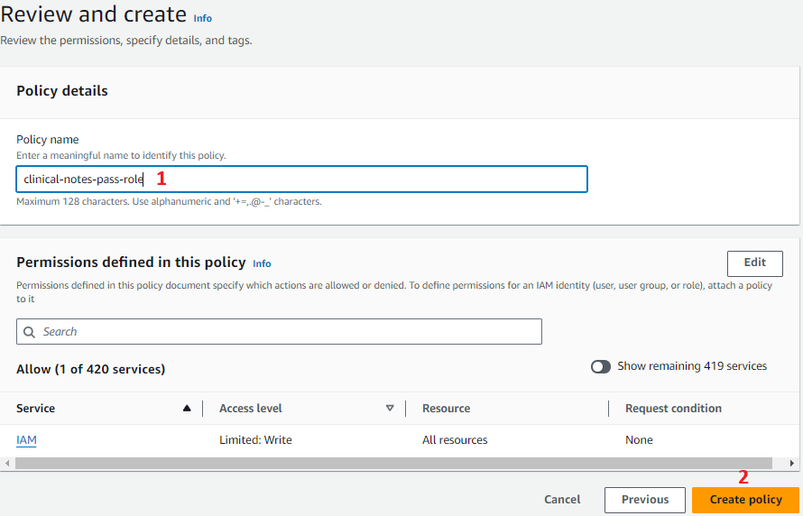

### Keep track of object names
Later on within the notebook, we will need to access the S3 bucket where the audio file is uploaded, the audio file name itself, and the IAM role name.

In this tutorial, I have used the following, however these, apart from the audio file name, are different for everyone:
- **\[S3_BUCKET_NAME\]**: `sample-data-024848443355-22hcl401`
- **\[OBJECT_NAME\]**: `lower-back-consultation.m4a`
- **\[IAM_ROLE\]**: `arn:aws:iam::024848443355:role/generate-clinical-notes-SageMakerNotebookRole-JGe7ip5jK3Gl`

## Enable Model Access to Foundation Models in Amazon Bedrock (NEEDS ATTENTION!)
Instructions on how to enable access to foundation models in Amazon Bedrock, along with detailed images, can be found in <a href="https://catalog.us-east-1.prod.workshops.aws/workshops/989c3aad-3f3e-405f-8519-13552cdd98eb/en-US/getting-started/bedrock-setup">Bedrock Model Access</a>.

For this, it is necessary to **switch to the us-west-2 (Oregon) region** when you land in the Amazon Bedrock page.

On the AWS tutorial page, Anthropic (5) is available. While creating this detailed tutorial, Anthropic (6) was out, however the models you should select remain the same (Claude 3 Sonnet and Claude 3 Haiku). Claude 3 Sonnet is and Claude 3 Haiku are both Text & Vision model, with Haiku being light and fast, while Sonnet is more "intelligent" and hard-working, offering a combination of performance and speed. 

Please note, that unlike the AWS tutorial demonstrates, you will need to provide `Use case details` such as company name, company website, industry and a description of the use case. These details are shared with Anthropic, and do not impact access to the models. **DO NOT MENTION** `Claude` within your description as this will be considered as PII and you will be denied access to the model. When accepted (this may take a few minutes), you will receive an email from AWS for product subscription.

Use of LLM models like these will result to charges which are not included in the free tier. When using these products, charges will vary based on your usage (or by the size of the instance you run the software on - not applicable for this tutorial). When you first activate the service, you will not be charged; more information on billing and payments can be found in the `Billing and Cost Management` service and specifically for Anthropic models can be found <a href="https://p6li1chk.r.us-east-1.awstrack.me/L0/https:%2F%2Faws.amazon.com%2Fmarketplace%2Fpp%2Fref=bill_eml_2%3Fsku=9gpietg9oyw4g370igogh95co/1/0100019139259f59-f2f62213-d36f-43a9-b523-e4b8e5f14bb1-000000/k0aY1OKY5x9vEuH0fZ4gw2hJK5o=386">here</a>. 

